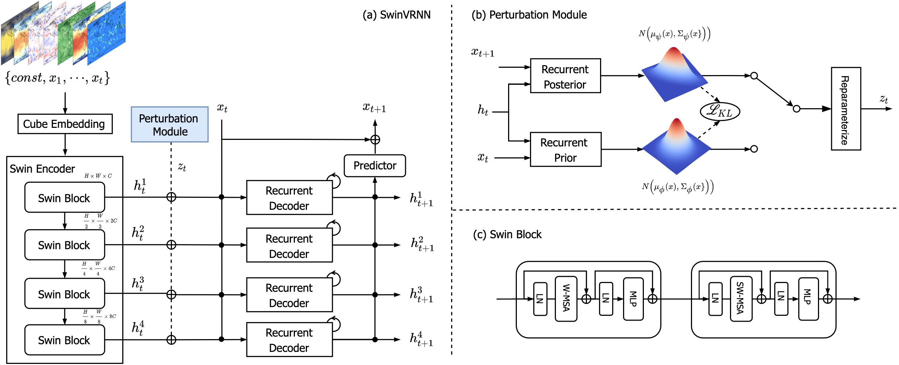

# SwinVRNN: A Data-Driven Ensemble Forecasting Model via Learned Distribution Perturbation



## Introduction

The repository contains the training, testing, and evaluation codes for SwinVRNN using Pytorch.

The data-driven approaches for medium-range weather forecasting are recently shown to be  extraordinarily promising for ensemble forecasting due to their fast inference speed compared to the traditional numerical weather prediction (NWP) models. However, their forecast accuracy can hardly match the state-of-the-art operational ECMWF Integrated Forecasting System (IFS) model. Previous data-driven approaches perform ensemble forecasting using some simple perturbation methods, like the initial condition perturbation and the Monte Carlo dropout. However, their ensemble performance is often limited arguably by the sub-optimal ways of applying perturbation. We propose a Swin Transformer-based Variational Recurrent Neural Network (SwinVRNN), which is a stochastic weather forecasting model combining a SwinRNN predictor with a perturbation module. SwinRNN is designed as a Swin Transformer-based recurrent neural network, which predicts the future states deterministically. Furthermore, to model the stochasticity in the prediction, we design a perturbation module following the Variational Auto-Encoder paradigm to learn the multivariate Gaussian distributions of a time-variant stochastic latent variable from the data. Ensemble forecasting can be easily performed by perturbing the model features leveraging the noise sampled from the learned distribution. We also compare four categories of perturbation methods for ensemble forecasting, i.e. fixed distribution perturbation, learned distribution perturbation, MC dropout, and multi model ensemble. Comparisons on the WeatherBench dataset show that the learned distribution perturbation method using our SwinVRNN model achieves remarkably improved forecasting accuracy and reasonable ensemble spread due to the joint optimization of the two targets. More notably, SwinVRNN surpasses operational IFS on the surface variables of the 2-m temperature and the 6-hourly total precipitation at all lead times up to five days. For more details, please refer to the [paper](https://arxiv.org/abs/2205.13158).

## Usage

**Install:**
python setup.py build develop

**Train SwinVRNN:**
```
export CUDA_VISIBLE_DEVICES=0,1,2,3,4,5,6,7
python tools/train_net.py \
    --config-file projects/wwprediction/configs/swinrnn_weather_bench.yaml \
    --num-gpus 8 \
    --dist-url "tcp://127.0.0.1:23456" \
```

**Test SwinVRNN:**
```
export CUDA_VISIBLE_DEVICES=0,1,2,3,4,5,6,7
python tools/train_net.py \
    --config-file projects/wwprediction/configs/swinrnn_weather_bench.yaml \
    --num-gpus 8 \
    --dist-url "tcp://127.0.0.1:23456" \
    --eval-only \
```

**Evaluation**
```
output_dir="output"
python -m pdb projects/wwprediction/tools/eval_wb.py \
    --data_dir data/weather_bench \
    --save_dir ${output_dir}/results \
    --pred_dir ${output_dir} \
    --step 6 \
    --interval 96 \
    --lead_time 120 \
    --input_frames 6 \
    --future_frames 20 \
    --eval_names z t t2m tp u10 v10 \
    --metrics "mse" \
```

## Citation
If SwinVRNN is useful for your research, please consider citing:
```
@article{hu2022swinvrnn,
  title={SwinVRNN: A Data-Driven Ensemble Forecasting Model via Learned Distribution Perturbation},
  author={Hu, Yuan and Chen, Lei and Wang, Zhibin and Li, Hao},
  journal={arXiv preprint arXiv:2205.13158},
  year={2022}
}
```